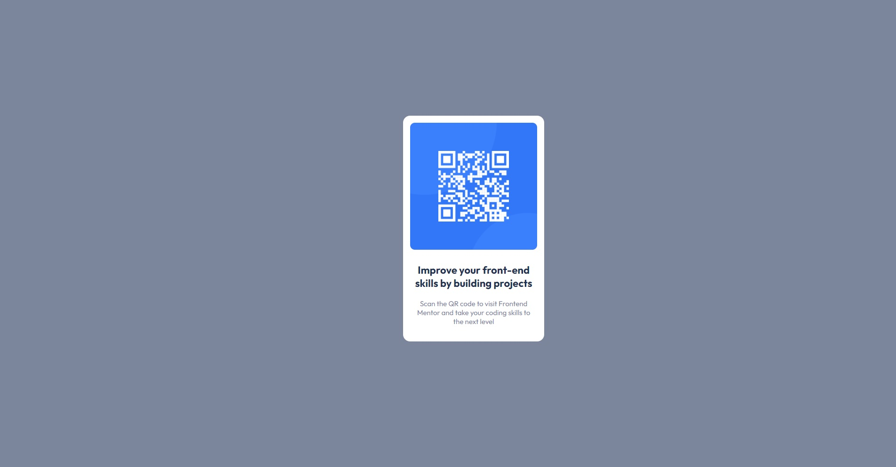

# Make-It-Real---QR-code-component
MakeItReal - Trabajo06 - Octubre 13 del 2022

## Tabla de contenido

- [Taller](#Taller)
- [Resultado](#Resultado)
- [Recursos](#Recursos)
    - [Caracteristicas](#Caracteristicas)
- [Conclusiones](#Conclusiones)

## Taller
    Realizar un contenedor con la información para el scan de un codigo QR.

    [Taller06](https://github.com/makeitrealcamp/top-v25/tree/main/challenges/qr-code-component)

## Resultado (Desktop & Mobile)

> Desktop

> Mobile

## Recursos

Se realizo con las tecnologias:
    - Html
    - Css

La imagen fue suministrada y las caracteristicas son las siguientes:

### Caracteristicas

    Guia de Estilo:

    - Mobile: 375px
    - Desktop: 1440px

    Colores:

    - White: hsl(0, 0%, 100%)
    - Light gray: hsl(212, 45%, 89%)
    - Grayish blue: hsl(220, 15%, 55%)
    - Dark blue: hsl(218, 44%, 22%)

    Tipografia:

    - Family: [Outfit](https://fonts.google.com/specimen/Outfit)
    - Weights: 400 / 700
    - Font size (paragraph): 15px

## Conclusiones

Para la realización del taller06 de Codigo Qr aplicamos algunas propiedades del css en su aliniación de contenido en el body y tamañados de estipulados sin alteración segun la resolución de los disositivos.